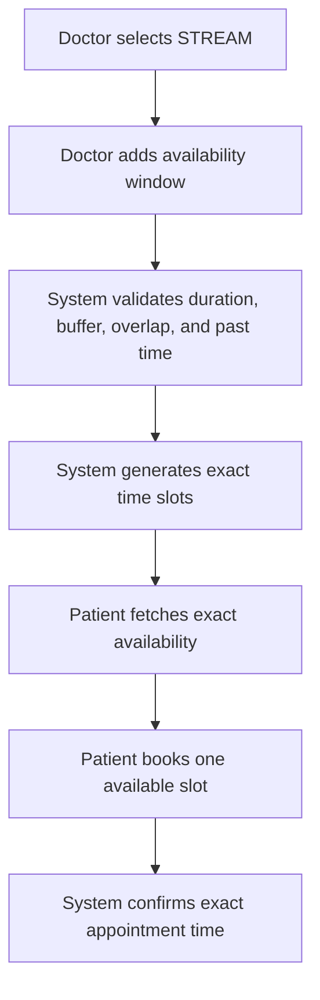
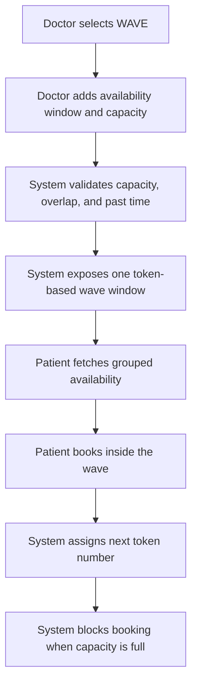

# Advanced Scheduling Flow

## Stream Scheduling Flow

```mermaid
flowchart TD
  A[Doctor selects STREAM] --> B[Doctor adds availability window]
  B --> C[System validates duration, buffer, overlap, and past time]
  C --> D[System generates exact time slots]
  D --> E[Patient fetches exact availability]
  E --> F[Patient books one available slot]
  F --> G[System confirms exact appointment time]
```

## Wave Scheduling Flow

```mermaid
flowchart TD
  A[Doctor selects WAVE] --> B[Doctor adds availability window and capacity]
  B --> C[System validates capacity, overlap, and past time]
  C --> D[System exposes one token-based wave window]
  D --> E[Patient fetches grouped availability]
  E --> F[Patient books inside the wave]
  F --> G[System assigns next token number]
  G --> H[System blocks booking when capacity is full]
```
