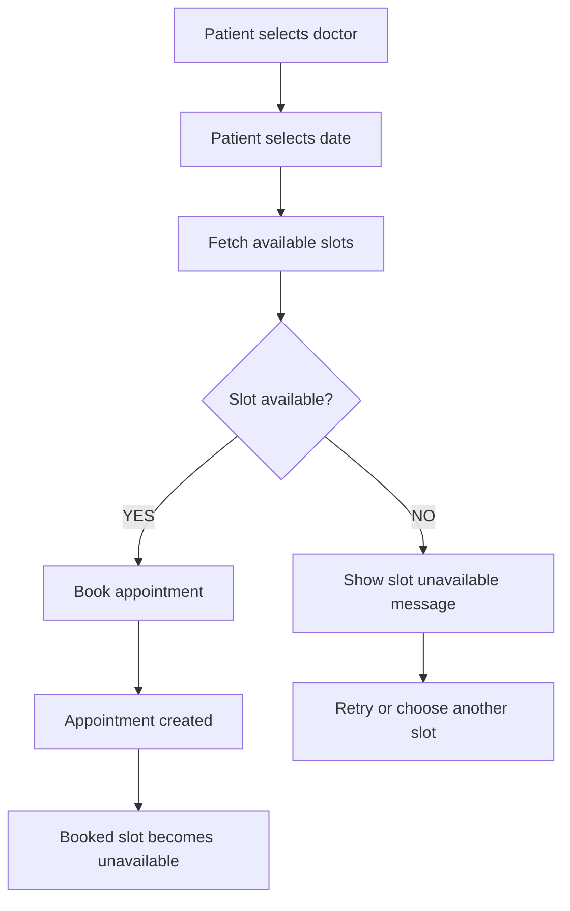

# Appointment Booking Flow

## Booking flow summary

1. Patient chooses a doctor.
2. Patient selects a date and fetches all available time slots.
3. The system checks whether the requested slot is still available.
4. If available, the appointment is created.
5. The same slot is blocked from being booked again.
6. If unavailable, the system shows a clear message and asks the patient to choose another slot.
