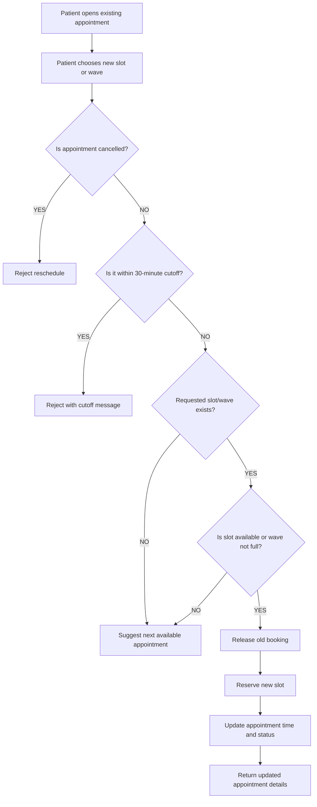

# Appointment Rescheduling Flow

## Rescheduling rules

1. Only the appointment owner can reschedule.
2. Cancelled appointments cannot be rescheduled.
3. Past appointments cannot be rescheduled.
4. Appointments within 30 minutes of start time cannot be rescheduled or cancelled.
5. For stream scheduling, the requested slot must exist and be free.
6. For wave scheduling, the target wave must exist and have capacity.
7. If the requested slot is unavailable, return the next suggested available time instead of failing silently.
